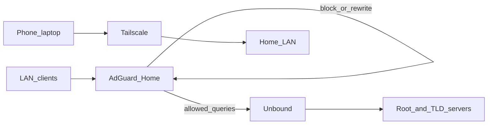

# Pi → HP Z2 Mini (Proxmox) migration

Move home DNS/filtering off BalenaOS + Pi-hole on the Raspberry Pi onto Proxmox VE on the Z2 Mini G4.

## Target stack (decision)

| Role | Tool | Notes |
| --- | --- | --- |
| DNS filter + UI | **AdGuard Home** | Replaces Pi-hole — better Docker/x86 fit, native DoH/DoT, stronger UI |
| Recursive resolver | **Unbound** | Keep — private resolution, no third-party forwarder |
| Remote access | **Tailscale** | Keep — subnet router from the network guest |
| Hypervisor | **Proxmox VE** | Thin host; no app services on the host |
| This stack runs in | **Debian 12 Docker VM** | 2 vCPU / 2 GB / 16–32 GB; bridged `vmbr0`; static LAN IP |

Pi-hole works on x86; we are **not** keeping it because AdGuard Home does the same job with a cleaner Compose story and better built-in DNS features. Unbound stays because recursive privacy is still the right design.

Source of truth for the new stack: [`stacks/network/`](../stacks/network/).

Root [`docker-compose.yml`](../docker-compose.yml) + [`balena.yml`](../balena.yml) remain for the live Pi until cutover, then retire them.



---

## Current Pi deployment (this repo)

- **BalenaOS** fleet (`balena.yml`)
- Compose: Pi-hole (custom build), Unbound (custom build), Tailscale
- Host networking for Pi-hole + Tailscale
- State in Docker volumes; env in Balena UI
- Default Pi-hole upstreams are Cloudflare unless you overrode them — Unbound may already be unused

---

## Proxmox layout (single Z2)

```text
Proxmox host          — management SSH / :8006 only
  VM network          — stacks/network (AGH + Unbound + Tailscale)
  VM media            — Plex + Intel iGPU Quick Sync (later)
  VM apps             — trading bot (later)
```

- Prefer **DHCP reservation** for the network VM’s LAN IP.
- **Reuse the Pi’s IP at cutover** when possible (fewest client changes).
- Persist under `/srv/network/data/{adguard,tailscale}`.

---

## Cutover (minimal downtime)

### Phase 0 — Prep (Pi still DNS)

1. Record Pi IP, router DNS/DHCP settings, Tailscale routes/auth approach.
2. Export useful Pi-hole bits manually (adlists URLs, local DNS records) — teleporter does not import into AdGuard; recreate lists/rewrites in AGH.
3. Install Proxmox on Z2; host IP ≠ Pi IP; SSH works.
4. Create Debian 12 VM `network` on `vmbr0`.

### Phase 1 — Parallel bring-up

1. Install Docker Engine + Compose plugin on the VM.
2. Clone repo; `cd stacks/network`; copy `.env.example` → `.env`.
3. `mkdir` data dirs; **seed** `AdGuardHome.yaml` into `$DATA_DIR/adguard/conf/`.
4. `docker compose up -d`.
5. Complete AGH wizard on `:3000`; confirm upstream `unbound:5053`.
6. Re-add blocklists / local rewrites from your Pi notes.
7. Test one client with **manual DNS = temp VM IP**.
8. Bring Tailscale up; approve subnet routes; rename node off `homenetwork-pi`.
9. Proxmox snapshot: `network-pre-cutover`.

### Phase 2 — DNS cutover

**Preferred — reuse Pi IP:**

1. Remove Pi DHCP reservation; stop/power off Pi.
2. Set network VM to old Pi IP; confirm `:53` and AGH UI.
3. Renew DHCP on a phone; verify query log.

**Alternate — new IP:** change router DHCP DNS option to the VM IP; leave Pi up 24h as rollback.

### Phase 3 — Decommission

1. Remove old Tailscale node after the new one is healthy.
2. Keep Pi SD as cold backup ~1 week.
3. Delete or archive root Balena/Pi-hole files when comfortable.

### Rollback

| Failure | Action |
| --- | --- |
| Bad DNS after IP reuse | Power off network VM; power on Pi; restore reservation |
| Bad DNS after DNS-option change | Point router DNS back at Pi |
| Config-only | Restore Proxmox snapshot `network-pre-cutover` |

---

## Pi / Balena assumptions that go away

| Old assumption | New approach |
| --- | --- |
| BalenaOS + `balena.yml` | Plain Docker on Debian VM |
| Custom Pi-hole image + `resin-dns` | Official `adguard/adguardhome` |
| `balena-init.sh` / Balena env UI | `.env` + AGH config under `/srv/network/data` |
| `homenetwork-pi` hostname | `TS_HOSTNAME=homenetwork` |
| Pi-hole teleporter restore | Manual list/rewrite migration into AGH |
| `systemd-resolved` free on Balena | Disable stub listener on Debian if port 53 busy |

---

## Repo layout

```text
docs/MIGRATION.md          — this file
docs/CHECKLIST.md          — phone-friendly runbook
stacks/network/            — AGH + Unbound + Tailscale (active target)
stacks/media/              — later
stacks/apps/               — later
docker-compose.yml         — legacy Balena Pi stack (until cutover)
balena.yml / pihole/       — legacy
```

---

## First commands on the network VM

```sh
sudo apt update && sudo apt install -y docker.io docker-compose-v2 git
sudo usermod -aG docker "$USER"   # re-login
sudo mkdir -p /srv/network/data/adguard/{work,conf} /srv/network/data/tailscale
cd /srv/network && git clone <this-repo> repo && cd repo/stacks/network
cp .env.example .env && ${EDITOR:-nano} .env
sudo cp adguard/AdGuardHome.yaml /srv/network/data/adguard/conf/
docker compose up -d
```

Then open `http://<temp-ip>:3000` and finish the wizard.
